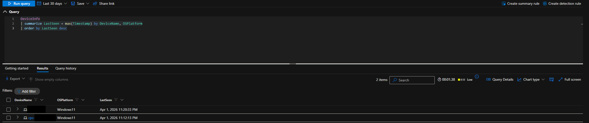
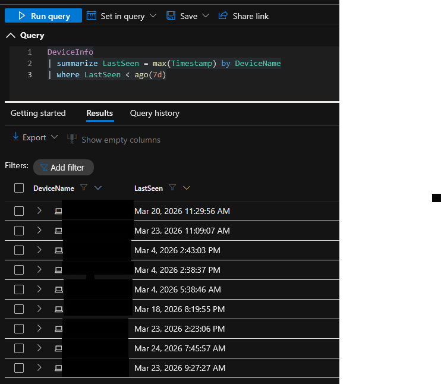
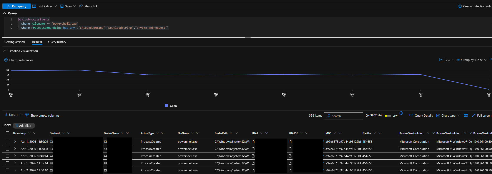
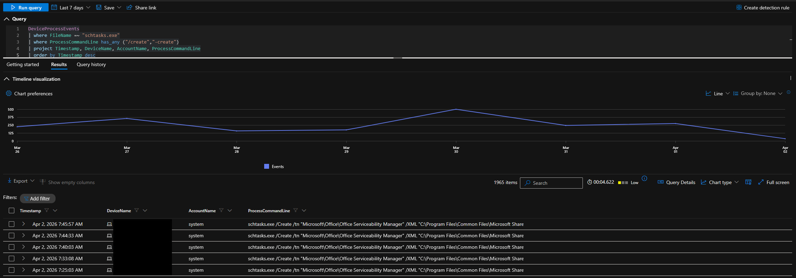
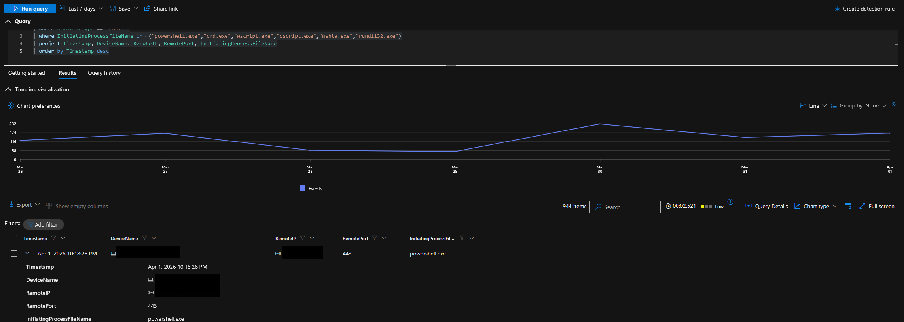

# 🔍 KQL Playbook Deep Dive

## 🧠 How to Use This Playbook

This playbook is designed for:

- validating Defender telemetry  
- identifying visibility gaps  
- threat hunting  
- detection engineering  

Each query includes:
- what it does  
- when to use it  
- what to look for  
- recommended remediation  

Start with onboarding validation, then move into hunting and detection.

## 🔄 Investigation Flow

Process → Network → Logon → Alerts → Identity → Email

---

# 🧠 Core Principle

> Dashboards show the story. KQL shows the evidence.

---

# 📑 Table of Contents

* [1. Onboarding Validation](#-1-onboarding-validation)
* [2. Discovery & Visibility](#-2-discovery--visibility)
* [3. Threat Hunting](#-3-threat-hunting)

---

# 🔍 1. ONBOARDING VALIDATION

## Devices Reporting

### 📸 Example Output



```kusto
DeviceInfo
| summarize LastSeen = max(Timestamp) by DeviceName, OSPlatform
| order by LastSeen desc
```
## Query Output Example


### Table Used

DeviceInfo → Device heartbeat and metadata

### What It Does

Finds the most recent reporting timestamp for each device.

### When to Use

* onboarding validation
* confirming device activity

### Normal vs Suspicious

* Normal: recent timestamps
* Suspicious: missing or delayed reporting

### Pivot

* process activity
* alerts

---

### 🔍 What to Look For

- devices missing recent check-in timestamps
- inconsistent reporting across similar systems
- newly onboarded devices not appearing

### 🛠️ Recommended Remediation

- verify device is active and powered on
- confirm Defender agent is installed and healthy
- check network connectivity
- re-onboard device if necessary
- remove decommissioned devices from inventory
  
---

## Stale Devices

```kusto
DeviceInfo
| summarize LastSeen = max(Timestamp) by DeviceName
| where LastSeen < ago(7d)
```


### What It Does

Finds devices not reporting recently.

### When to Use

* onboarding gaps
* telemetry validation

### Suspicious

Active devices going silent.

### 🔍 What to Look For

- devices not reporting within expected timeframe
- critical systems appearing inactive
- sudden drop-off in reporting devices

### 🛠️ Recommended Remediation

- verify device is still in use
- check Defender sensor health
- confirm network access to Microsoft services
- re-onboard device if necessary
  
---

# 📊 2. DISCOVERY & VISIBILITY

## Process Telemetry

```kusto
DeviceProcessEvents
| summarize count() by DeviceName
```

### What It Does

Confirms endpoint activity is being captured.

### Suspicious

Devices with very low activity.

---

## Alert Visibility

```kusto
DeviceAlertEvents
| summarize count() by DeviceName
```

### What It Does

Shows alert distribution across devices.

### Suspicious

Devices with no alerts despite activity.

### 🔍 What to Look For

- devices with no alerts despite active telemetry
- unusually high alert volume on single devices
- mismatch between activity and alerts

### 🛠️ Recommended Remediation

- review alert policies and coverage
- validate detection configurations
- investigate noisy endpoints
- tune alert rules as needed
  
---

# ⚠️ 3. THREAT HUNTING

## Suspicious PowerShell

```kusto
DeviceProcessEvents
| where FileName =~ "powershell.exe"
| where ProcessCommandLine has_any ("EncodedCommand","DownloadString","Invoke-WebRequest")
```



### What It Does

Detects common attacker scripting patterns.

### Suspicious

Encoded commands, downloads.

---

### 🔍 What to Look For

- encoded or obfuscated commands (`-enc`, base64)
- download activity (`DownloadString`, `Invoke-WebRequest`)
- unusual users running PowerShell
- execution from temp or user directories

---

### 🛠️ Recommended Remediation

**High Confidence (malicious behavior confirmed)**
- isolate the device
- initiate full antivirus scan
- collect investigation package
- review all recent PowerShell activity on the device
- reset credentials for affected account

**Medium Confidence (needs validation)**
- review command line for legitimacy
- validate user activity
- monitor for repeated behavior

---

## Office → Script Execution

```kusto
DeviceProcessEvents
| where InitiatingProcessFileName in~ ("winword.exe","excel.exe","outlook.exe")
| where FileName in~ ("powershell.exe","cmd.exe","wscript.exe")
```

### What It Does

Detects macro/phishing execution chains.

---

### Detection

🔥 Very High

---

### 🔍 What to Look For

- Word, Excel, or Outlook spawning PowerShell or cmd
- script execution immediately after document open
- unusual command-line arguments
- activity tied to recent email delivery

### 🛠️ Recommended Remediation

**High Confidence**
- isolate device immediately
- investigate email source and attachments
- block sender/domain if malicious
- reset user credentials
- review lateral movement activity

**Medium Confidence**
- validate document source
- check for known macros or business use
- monitor device behavior

---

# 🔥 Section Summary

* onboarding = validation
* visibility = confirmation
* hunting = detection

---

# 🔐 4. PERSISTENCE HUNTING

## Registry Autorun Persistence

```kusto
DeviceRegistryEvents
| where RegistryKey has_any (
    "\\Software\\Microsoft\\Windows\\CurrentVersion\\Run",
    "\\Software\\Microsoft\\Windows\\CurrentVersion\\RunOnce"
)
| project Timestamp, DeviceName, RegistryKey, RegistryValueName, RegistryValueData, InitiatingProcessFileName
| order by Timestamp desc
```

### Table Used

DeviceRegistryEvents → Registry modification activity

### What It Does

Identifies changes to registry locations commonly used for persistence.

### When to Use

* post-compromise investigation
* persistence hunting

### Normal vs Suspicious

* Normal: known applications
* Suspicious: unknown binaries, scripts in temp paths

### Pivot

* process execution
* file creation
* user context

### Detection Potential

🔥 High (after filtering known apps)

---

### 🔍 What to Look For

- entries in Run or RunOnce keys
- executables in temp or user directories
- unknown or unsigned binaries
- persistence linked to recent activity

### 🛠️ Recommended Remediation

**High Confidence**
- remove malicious registry entry
- isolate device
- investigate associated file
- review persistence across system

**Medium Confidence**
- validate application legitimacy
- compare against known baseline

---

## Scheduled Task Creation

```kusto
DeviceProcessEvents
| where FileName =~ "schtasks.exe"
| where ProcessCommandLine has_any ("/create","-create")
| project Timestamp, DeviceName, AccountName, ProcessCommandLine
| order by Timestamp desc
```



### Table Used

DeviceProcessEvents

### What It Does

Detects creation of scheduled tasks used for persistence or delayed execution.

### When to Use

* persistence detection
* attacker automation

### Normal vs Suspicious

* Normal: IT automation
* Suspicious: hidden or unusual task names

### Pivot

Check the following:

- DeviceProcessEvents → what executed
- DeviceFileEvents → what file was dropped
- DeviceNetworkEvents → did it call out
- DeviceLogonEvents → who created it

## 🧠 Note

Scheduled tasks are often used in combination with:
- PowerShell execution
- file staging in temp directories
- outbound network connections

Always correlate task creation with process and network activity.

### Detection Potential

🔥 High

### 🛠️ Recommended Remediation

**High Confidence (malicious persistence identified)**
- isolate the device immediately
- disable or delete the scheduled task
- identify and remove the associated file or script
- run full antivirus scan
- review all scheduled tasks on the device for additional persistence
- reset credentials for the affected account
- investigate lateral movement or additional compromise

**Medium Confidence (suspicious but unconfirmed)**
- validate task name and purpose with system owner
- review execution path and associated file
- monitor task execution behavior
- check for repeated or similar task creation across environment

**Low Confidence (likely benign)**
- document known task
- add to allowlist for future filtering

---

## Service Creation (Persistence / Privilege Abuse)

```kusto
DeviceProcessEvents
| where FileName in~ ("sc.exe","powershell.exe")
| where ProcessCommandLine has_any (" create ", "New-Service")
| project Timestamp, DeviceName, AccountName, FileName, ProcessCommandLine
| order by Timestamp desc
```

### Table Used

DeviceProcessEvents

### What It Does

Detects creation of Windows services, often used for persistence or privilege escalation.

### When to Use

* post-exploitation
* persistence hunting

### Suspicious

* services pointing to temp paths
* unknown service names

### Pivot

* service binary
* process execution

### Detection Potential

🔥 High

---

### 🔍 What to Look For

- new or unusual service names
- services pointing to temp or user directories
- services created by non-admin users
- PowerShell-based service creation

### 🛠️ Recommended Remediation

**High Confidence**
- disable or remove service
- isolate device
- investigate service binary
- review privilege escalation activity

**Medium Confidence**
- validate service purpose
- monitor for repeated creation

---

# 🔑 5. CREDENTIAL & ACCOUNT ABUSE

## Failed Logons

```kusto
DeviceLogonEvents
| where ActionType == "LogonFailed"
| summarize FailedCount = count() by DeviceName, AccountName
| where FailedCount > 10
| order by FailedCount desc
```

### Table Used

DeviceLogonEvents → Authentication events

### What It Does

Identifies repeated failed logon attempts.

### When to Use

* brute force detection
* password spray

### Normal vs Suspicious

* Normal: occasional failures
* Suspicious: repeated attempts

### Pivot

* successful logons
* account activity

### Detection Potential

✅ Medium–High

---

### 🔍 What to Look For

- repeated failed attempts for one account
- multiple accounts failing from one device
- rapid login attempts (spray behavior)
- failures followed by successful login

### 🛠️ Recommended Remediation

**High Confidence**
- block source device or IP
- reset credentials
- enforce MFA
- investigate brute force activity

**Medium Confidence**
- monitor login attempts
- review authentication patterns
  
---

## Account Across Multiple Devices

```kusto
DeviceLogonEvents
| summarize DeviceCount = dcount(DeviceName) by AccountName
| where DeviceCount > 5
| order by DeviceCount desc
```

### Table Used

DeviceLogonEvents

### What It Does

Finds accounts used across many devices.

### When to Use

* lateral movement detection
* shared credentials

### Normal vs Suspicious

* Normal: admin accounts
* Suspicious: standard users on many devices

### Pivot

* timeline analysis
* process activity

### Detection Potential

⚠️ Context dependent

---

# 🌐 6. NETWORK HUNTING

## External Connections from Scripting Tools

```kusto
DeviceNetworkEvents
| where RemoteIPType == "Public"
| where InitiatingProcessFileName in~ ("powershell.exe","cmd.exe","wscript.exe","cscript.exe","mshta.exe","rundll32.exe")
| project Timestamp, DeviceName, RemoteIP, RemotePort, InitiatingProcessFileName
| order by Timestamp desc
```



### Table Used

DeviceNetworkEvents → Network connections

### What It Does

Identifies outbound connections from scripting or command-line tools.

### When to Use

* command and control detection
* suspicious downloads

---

### Normal vs Suspicious

* Normal: known infrastructure
* Suspicious: rare IPs, unusual behavior

### Pivot

* process command line
* rare IP analysis

### Detection Potential

🔥 High

---

### 🔍 What to Look For

- scripting tools connecting to public IPs
- rare or unknown external destinations
- unusual ports or repeated connections
- command-line activity tied to network calls

### 🛠️ Recommended Remediation

**High Confidence**
- isolate device
- block remote IP/domain
- run antivirus scan
- review command-line execution chain
- investigate potential command-and-control activity

**Medium Confidence**
- validate destination IP/domain
- compare against known infrastructure
- monitor for repeated connections

---

## Rare External IPs

```kusto
DeviceNetworkEvents
| summarize DeviceCount = dcount(DeviceName) by RemoteIP
| where DeviceCount < 3
| order by DeviceCount asc
```

### Table Used

DeviceNetworkEvents

### What It Does

Finds IPs rarely seen across the environment.

### When to Use

* anomaly hunting
* threat intel pivot

### Suspicious

* uncommon external infrastructure

### Detection Potential

⚠️ Hunting query

---

### 🔍 What to Look For

- IPs seen on very few devices
- uncommon external infrastructure
- connections tied to scripting tools
- lack of known business purpose

### 🛠️ Recommended Remediation

**High Confidence**
- block IP/domain via Defender or firewall
- isolate affected device
- review all connections to the IP across environment
- investigate associated processes

**Medium Confidence**
- validate IP against threat intelligence
- monitor for repeated communication

**Low Confidence**
- document known external services
- allowlist if legitimate

---

## Unusual Public Port Usage

```kusto
DeviceNetworkEvents
| where RemoteIPType == "Public"
| summarize ConnectionCount = count() by RemotePort, InitiatingProcessFileName
| order by ConnectionCount asc
```

### Table Used

DeviceNetworkEvents

### What It Does

Identifies uncommon port usage patterns.

### When to Use

* anomaly detection
* C2 investigation

### Suspicious

* rare ports
* scripting tools using unusual ports

### Detection Potential

⚠️ Needs tuning

---

# 🔥 Section Summary

* Persistence → how attackers stay
* Identity → how attackers move
* Network → how attackers communicate

These layers start connecting behavior across the environment.

---

### 🔍 What to Look For
- uncommon or non-standard ports
- scripting tools using unusual ports
- repeated connections on rare ports
- outbound traffic not aligned with normal application behavior

### 🛠️ Recommended Remediation

**High Confidence**
- block suspicious port or destination
- isolate device if malicious activity confirmed
- investigate process using the port

**Medium Confidence**
- validate port usage against expected application behavior
- monitor for recurrence
---

# 🔑 5. CREDENTIAL & ACCOUNT ABUSE

## Failed Logons

```kusto
DeviceLogonEvents
| where ActionType == "LogonFailed"
| summarize FailedCount = count() by DeviceName, AccountName
| where FailedCount > 10
| order by FailedCount desc
```

### Table Used

DeviceLogonEvents → Authentication events

### What It Does

Identifies repeated failed logon attempts.

### When to Use

* brute force detection
* password spray

### Normal vs Suspicious

* Normal: occasional failures
* Suspicious: repeated attempts

### Pivot

* successful logons
* account activity

### Detection Potential

✅ Medium–High

---

## Account Across Multiple Devices

```kusto
DeviceLogonEvents
| summarize DeviceCount = dcount(DeviceName) by AccountName
| where DeviceCount > 5
| order by DeviceCount desc
```

### Table Used

DeviceLogonEvents

### What It Does

Finds accounts used across many devices.

### When to Use

* lateral movement detection
* shared credentials

### Normal vs Suspicious

* Normal: admin accounts
* Suspicious: standard users on many devices

### Pivot

* timeline analysis
* process activity

### Detection Potential

⚠️ Context dependent

### 🔍 What to Look For

- accounts used across many devices
- unusual spread of standard user accounts
- access inconsistent with normal behavior

### 🛠️ Recommended Remediation

**High Confidence**
- reset credentials
- investigate lateral movement
- restrict account access

**Medium Confidence**
- validate usage patterns
- monitor for abnormal activity

---

# 🌐 6. NETWORK HUNTING

## External Connections from Scripting Tools

```kusto
DeviceNetworkEvents
| where RemoteIPType == "Public"
| where InitiatingProcessFileName in~ ("powershell.exe","cmd.exe","wscript.exe","cscript.exe","mshta.exe","rundll32.exe")
| project Timestamp, DeviceName, RemoteIP, RemotePort, InitiatingProcessFileName
| order by Timestamp desc
```

### Table Used

DeviceNetworkEvents → Network connections

### What It Does

Identifies outbound connections from scripting or command-line tools.

### When to Use

* command and control detection
* suspicious downloads

### Normal vs Suspicious

* Normal: known infrastructure
* Suspicious: rare IPs, unusual behavior

### Pivot

* process command line
* rare IP analysis

### Detection Potential

🔥 High

### 🔍 What to Look For

- scripting tools connecting to public IPs
- PowerShell, cmd, or mshta initiating outbound traffic
- rare or unknown external destinations
- unusual command-line activity tied to connections

### 🛠️ Recommended Remediation

---

## Rare External IPs

```kusto
DeviceNetworkEvents
| summarize DeviceCount = dcount(DeviceName) by RemoteIP
| where DeviceCount < 3
| order by DeviceCount asc
```

### Table Used

DeviceNetworkEvents

### What It Does

Finds IPs rarely seen across the environment.

### When to Use

* anomaly hunting
* threat intel pivot

### Suspicious

* uncommon external infrastructure

### Detection Potential

⚠️ Hunting query

### 🔍 What to Look For

- IPs seen on very few devices
- uncommon external infrastructure
- connections tied to scripting tools
- lack of known business purpose

### 🛠️ Recommended Remediation

**High Confidence**
- block IP/domain
- isolate affected device
- investigate associated processes

**Medium Confidence**
- validate IP with threat intelligence
- monitor for repeated connections

### 🛠️ Recommended Remediatio

---

## Unusual Public Port Usage

```kusto
DeviceNetworkEvents
| where RemoteIPType == "Public"
| summarize ConnectionCount = count() by RemotePort, InitiatingProcessFileName
| order by ConnectionCount asc
```

### Table Used

DeviceNetworkEvents

### What It Does

Identifies uncommon port usage patterns.

### When to Use

* anomaly detection
* C2 investigation

### Suspicious

* rare ports
* scripting tools using unusual ports

### Detection Potential

⚠️ Needs tuning

### 🔍 What to Look For

- uncommon or rarely used ports (non-80/443/53)
- scripting tools using unusual ports (PowerShell, cmd, mshta)
- outbound connections on high or non-standard ports
- repeated connections to the same port across devices

### 🧠 Note

Unusual port usage often becomes more meaningful when correlated with:
- scripting tool execution
- rare external IP connections
- recent file downloads or payload execution

---

### 🛠️ Recommended Remediation

**High Confidence (suspicious network activity confirmed)**
- isolate the device
- block the remote IP and/or port
- investigate the initiating process and command line
- review related network activity across the environment
- run antivirus scan and check for persistence mechanisms

**Medium Confidence (unusual but not confirmed malicious)**
- validate port usage against expected application behavior
- check if port is used by known software or services
- monitor for repeated or expanding activity

**Low Confidence (likely benign)**
- document known application behavior
- add to allowlist for future filtering

---

# 🔥 Section Summary

* Persistence → how attackers stay
* Identity → how attackers move
* Network → how attackers communicate

These layers start connecting behavior across the environment.

---

### 🛠️ Recommended Remediation

**High Confidence**
- block suspicious port or destination
- isolate device if malicious activity confirmed
- investigate process using the port

**Medium Confidence**
- validate port usage against expected application behavior
- monitor for recurrence

---

# 📂 7. FILE ACTIVITY HUNTING

## Suspicious File Creation (Temp / Public Paths)

```kusto id="p9k3lz"
DeviceFileEvents
| where FolderPath has_any ("\\AppData\\Local\\Temp\\","\\Users\\Public\\","\\Windows\\Temp\\")
| project Timestamp, DeviceName, FileName, FolderPath, InitiatingProcessFileName
| order by Timestamp desc
```

### Table Used

DeviceFileEvents → File activity on endpoints

### What It Does

Finds files created in common attacker staging locations.

### When to Use

* malware staging detection
* post-execution investigation
  
### Normal vs Suspicious

* Normal: installers, temp files
* Suspicious: executables/scripts in temp directories

### Pivot

* process execution
* network activity
* file hash lookup

### Detection Potential

✅ Medium–High (needs filtering)

---

### 🔍 What to Look For

- executables or scripts in temp/public folders
- files created by scripting tools
- unusual or random file names
- activity tied to recent downloads
  
### 🛠️ Recommended Remediation

**High Confidence**
- isolate device
- delete malicious file
- run full antivirus scan
- review file origin and execution chain

**Medium Confidence**
- validate file legitimacy
- check file hash reputation
- monitor execution behavior

---

## Archive / Compression Activity

```kusto id="1d4y7p"
DeviceProcessEvents
| where FileName in~ ("7z.exe","winrar.exe","rar.exe","powershell.exe")
| where ProcessCommandLine has_any (".zip",".rar",".7z","Compress-Archive")
| project Timestamp, DeviceName, AccountName, FileName, ProcessCommandLine
| order by Timestamp desc
```

### What It Does

Detects file compression, often used before data exfiltration.

### When to Use

* insider risk
* data staging

### Suspicious

* large archive operations
* unusual directories

### Detection Potential

⚠️ Context dependent

### 🔍 What to Look For

- large or repeated archive creation
- compression in unusual directories
- activity by non-admin users
- behavior preceding external connections

### 🛠️ Recommended Remediation

**High Confidence**
- investigate files being archived
- check for sensitive data exposure
- review user intent and behavior
- restrict data access if needed

**Medium Confidence**
- validate business use case
- monitor for large or repeated archive activity

---

## Certutil Abuse (Download / Decode)

```kusto id="yq0xtp"
DeviceProcessEvents
| where FileName =~ "certutil.exe"
| where ProcessCommandLine has_any ("-urlcache","-decode","http")
| project Timestamp, DeviceName, AccountName, ProcessCommandLine
| order by Timestamp desc
```

### What It Does

Detects abuse of certutil to download or decode payloads.

### Detection Potential

🔥 High

---

### 🔍 What to Look For

- use of `-urlcache` or `-decode`
- external downloads via certutil
- encoded or decoded payloads
- execution followed by file creation

### 🛠️ Recommended Remediation

**High Confidence**
- isolate device immediately
- block associated URL/IP
- investigate downloaded or decoded content
- review for additional payload execution

**Medium Confidence**
- validate usage against known admin activity
- monitor command usage patterns

---

# 🧪 8. ANOMALY HUNTING

## Rare Processes

```kusto id="d8ahvc"
DeviceProcessEvents
| summarize SeenCount = count() by FileName
| where SeenCount < 5
| order by SeenCount asc
```

### What It Does

Finds processes rarely seen across the environment.

### When to Use

* anomaly detection
* unknown binaries

### Suspicious

* uncommon executables

### Detection Potential

⚠️ Hunting only

---

### 🔍 What to Look For

- processes seen on very few devices
- unknown or unsigned executables
- unexpected binaries on user systems
- activity tied to suspicious execution chains

### 🛠️ Recommended Remediation

**High Confidence**
- isolate device
- analyze process binary
- check hash against threat intelligence
- review execution context

**Medium Confidence**
- validate process against known software inventory
- monitor for additional executions

---

## Unusual Low Activity Devices

```kusto id="l2vntp"
DeviceProcessEvents
| summarize ProcessCount = count() by DeviceName
| where ProcessCount < 10
```

### What It Does

Identifies devices with unusually low activity.

### Suspicious

* devices not reporting properly
* stealth activity

### Detection Potential

❌ No

### 🔍 What to Look For

- devices with little or no telemetry
- inconsistent reporting patterns
- active systems appearing inactive

### 🛠️ Recommended Remediation

- verify endpoint is active
- confirm Defender sensor health
- check connectivity and telemetry ingestion
- re-onboard device if needed

---

# 🔧 9. NOISE REDUCTION & ADVANCED FILTERING

## Exclude Known Accounts

```kusto id="3q5v8n"
| where AccountName !in~ ("admin","svc_account","automation_user")
```

### What It Does

Removes known expected activity.

### Impact

* reduces noise
* improves detection quality

---

### 🛠️ Purpose
These filters are used to reduce false positives and improve detection accuracy before creating alerts.

---

## Exclude Management Tools

```kusto id="6a2cnb"
| where InitiatingProcessCommandLine !has_any ("SCCM","Intune","CompanyPortal")
```

### What It Does

Filters enterprise management activity.

### Impact

🔥 Critical before production detections

---

# ⚙️ 10. DETECTION TUNING & WORKFLOW

## Before (Noisy Query)

```kusto id="k0x91v"
DeviceProcessEvents
| where FileName =~ "powershell.exe"
```

---

## After (Detection-Ready)

```kusto id="9yzp0e"
DeviceProcessEvents
| where FileName =~ "powershell.exe"
| where ProcessCommandLine has_any ("EncodedCommand","DownloadString","Invoke-WebRequest")
| where AccountName !in~ ("admin","svc_account")
| project Timestamp, DeviceId, DeviceName, ReportId, AccountName, ProcessCommandLine
```

---

### What Changed

* added behavioral filters
* removed known noise
* preserved key fields

---

## When a Query Becomes a Detection

A query is ready when:

* results are consistent
* noise is minimized
* behavior is clearly suspicious

---

## Investigation Workflow

1. Validate device
2. Review processes
3. Check network
4. Analyze logons
5. Review alerts
6. Add identity context
7. Confirm threat

---

## Pivot Model

**Process → Network → Logon → Alerts → Identity → Email**

---

## Creating a Detection Rule

Steps:

1. Go to **security.microsoft.com**
2. Open **Advanced Hunting**
3. Run query
4. Validate results
5. Click **Create detection rule**
6. Configure:

   * severity
   * frequency
   * entities

---

## Recommended Automated Actions

### High Confidence

* isolate device
* run antivirus scan
* collect investigation package

### Medium Confidence

* monitor
* initiate investigation

---

# 🔥 Final Section Summary

* File → staging & payloads
* Anomaly → outliers
* Filtering → signal clarity
* Detection → operationalization

---

# 🧭 Final Insight

> This is no longer just a set of queries.
> This is a full operational detection framework.

# 🛡️ Custom Detection Creation (Defender XDR)

🎯 Goal

Turn validated KQL queries into automated detections and alerts.

🧭 Step-by-Step
1. Open Advanced Hunting

Go to:

👉 https://security.microsoft.com

Navigate:

Hunting → Advanced Hunting
2. Run Your Query
paste your KQL query
validate results
confirm:
low noise
consistent behavior
3. Create Detection Rule

Click:

👉 “Create detection rule”

⚙️ Recommended Settings
🔴 Severity
Scenario	Severity
Confirmed malicious (PowerShell, Office chain)	High
Suspicious but needs context	Medium
Validation / anomaly queries	Low or none
⏱️ Frequency
Use Case	Frequency
Active threats	Every 5–15 minutes
General monitoring	Hourly
Baseline/anomaly	Daily
📊 Lookback Period

Recommended:

24 hours for most detections
shorter for high-risk queries
👤 Entities (CRITICAL)

Always map:

Device
Account

Optional:

IP address
File hash

👉 This enables:

investigation graph
automated response
🤖 Automated Actions
🔥 High Confidence Detections
isolate device
run antivirus scan
collect investigation package
⚠️ Medium Confidence
trigger investigation
alert SOC team
monitor behavior
🚨 Example: PowerShell Detection

Use query:

DeviceProcessEvents
| where FileName =~ "powershell.exe"
| where ProcessCommandLine has_any ("EncodedCommand","DownloadString","Invoke-WebRequest")
| where AccountName !in~ ("admin","svc_account")

Recommended:

Severity: High
Frequency: 15 minutes
Action: isolate device

---

# 🧠 Analyst Guidance

This playbook is designed to support:

- telemetry validation  
- threat hunting  
- detection engineering  
- incident response  

Each query should be:
- validated in your environment  
- tuned to reduce noise  
- operationalized as needed  

> KQL is not just for hunting — it is for validating, Stay Safe Defenders!

---

## 🔎 Investigation Workflows

The following workflows provide step-by-step guidance for investigating common Defender scenarios using KQL.

These are designed to help transition from:
- raw query execution  
- to structured investigation and decision-making  

---
